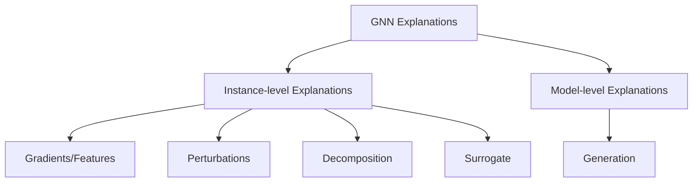

## Overview

```mermaid
graph TD
    A[GNN Explanations]
    A --> B[Instance-level Explanations]
    A --> C[Model-level Explanations]

    B --> B1[Gradients/Features]
    B --> B2[Perturbations]
    B --> B3[Decomposition]
    B --> B4[Surrogate]
    
    C --> C2[Generation]
```
