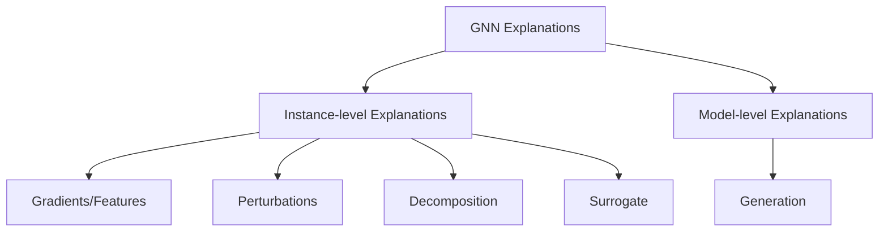

## Post-hoc methods
generate explanations for already trained models

## Self-explaination
*"being explainable by design"*  or produce [[Attributional Explanation]]s along side predictions due to explaination-supervised training
## [[Graph Attention Network]]
###  [[GNNExplainer]]
###  [[MEGAN]]