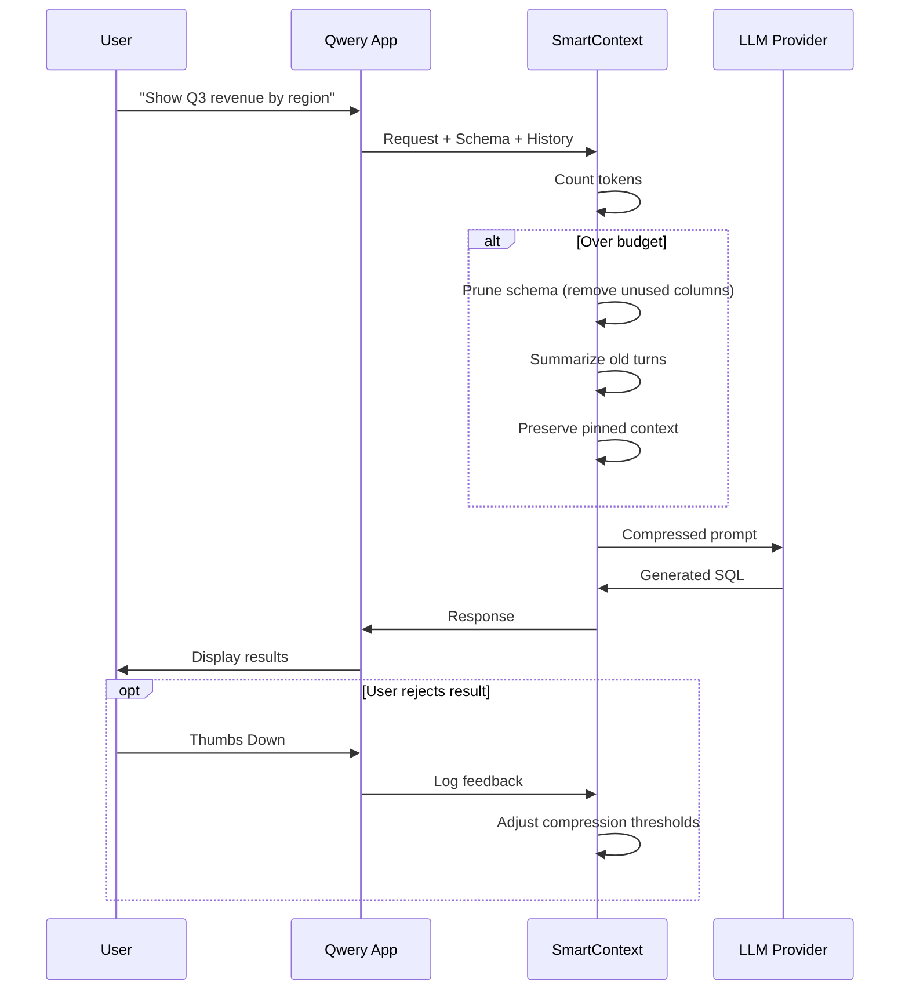

# **PFA Proposal:  Adaptive Context Optimization for AI Data Agents**

**Target Platform:** Qwery (Agent Factory SDK)
**Team Size:** 3 Students
**Duration:** 12–16 Weeks (3–4 Months)

---
## **1. Problem Statement**

Long-running AI data agents face a critical bottleneck with context overflow; Database schemas, query history, and conversation turns easily accumulate until they exceed the LLM's context window, causing the agent to "forget" earlier instructions (the "[[Lost-in-the-Middle]]" phenomenon) causing user frustration.

**Project Goal:** Build a middleware layer that dynamically [[Context Compression |compresses context]], reducing token consumption while preserving accuracy and enabling longer agent sessions.

---
## **2. Proposed Solution: SmartContext Middleware**

SmartContext is a transparent proxy that sits between the `FactoryAgent` and LLM providers. It intelligently compresses context to maximize information density within token limits.

| Strategy                  | Mechanism                                                                      | Benefit                                 |
| :------------------------ | :----------------------------------------------------------------------------- | :-------------------------------------- |
| **Schema Compression**    | Strips redundant type descriptions and unused columns based on query relevance | Reduces schema tokens                   |
| **History Summarization** | Condenses old conversation turns into compact narrative summaries              | Preserves context without token bloat   |
| **Adaptive Pruning**      | Dynamically adjusts compression level based on remaining token budget          | Prevents context overflow automatically |

---

## **3. Core Components**

### 3.1 Schema Pruner

- **Column Filtering:** Removes columns irrelevant to the current query intent.
- **Type Simplification:** Replaces verbose type definitions with compact representations.
- **Relationship Preservation:** Maintains foreign key relationships critical for JOIN generation.

### 3.2 History Summarizer

- **Turn Condensation:** Summarizes the last N conversation turns into a single narrative paragraph using a lightweight LLM.
- **Intent Extraction:** Preserves key user intents and decisions from prior turns.
- **Recency Weighting:** Recent turns remain detailed; older turns are aggressively summarized.

### 3.3 Pinned Context Manager

- **Critical Elements:** Active queries, user-defined views, and session constraints are never compressed.
- **Fallback:** If compression fails, FIFO truncation ensures the agent never exceeds the token limit.

### 3.4 Feedback Loop

- **Quality Signals:** When a user rejects a result, the system omits it from the compression log.
- **Adaptive Thresholds:** Compression aggressiveness adjusts based on error rates

---
## **4. Technical Stack**

| Layer          | Technology           | Purpose                                                      |
| :------------- | :------------------- | :----------------------------------------------------------- |
| Runtime        | TypeScript (Fastify) | Native integration with Agent Factory SDK                    |
| State Machine  | XState v5            | Manages `CONTEXT_OVERFLOW` and `COMPRESSION_COMPLETE` events |
| Token Counting | Vercel AI SDK        | Accurate token budgeting per model                           |
| Summarization  | Lightweight LLM      | Fast context summarization                                   |
| Observability  | OpenTelemetry        | Tracks token savings, latency, and compression rates         |

---

## **5. Implementation Roadmap**

| Phase                        | Weeks | Deliverables                                       |
| :--------------------------- | :---- | :------------------------------------------------- |
| **1.  Proxy**                | 1–3   | Middleware intercepts all LLM traffic              |
| **2. Schema Compression**    | 4–6   | Schema pruner and column filtering                 |
| **3. History Summarization** | 7–9   | Summarizer active and recency-weighted compression |
| **4. Feedback & Tuning**     | 10–14 | Feedback loop connected; compression optimized     |

---

## **6. Team Roles**

| Role                      | Responsibilities                                                                   |
| :------------------------ | :--------------------------------------------------------------------------------- |
| **Backend Architect**     | Proxy server, streaming response handling, token budget management                 |
| **Optimization Engineer** | Compression algorithms, summarization prompts, schema relevance scoring            |
| **Full-Stack Developer**  | Frontend feedback integration, "Context Inspector" debug UI, token savings overlay |

---

## **7. Success Metrics**

| Metric                | Target                                  | Measurement Method                    |
| :-------------------- | :-------------------------------------- | :------------------------------------ |
| Token Reduction       | ≥40% on long sessions                   | OpenTelemetry before/after comparison |
| Max Session Length    | 2× baseline (conversation turns)        | Session analytics                     |
| Compression Latency   | <200ms overhead                         | End-to-end timing                     |
| Accuracy Preservation | No regression vs. uncompressed baseline | A/B test on held-out query set        |

---

## **8. Risks & Mitigations**

| Risk                               | Mitigation                                                         |
| :--------------------------------- | :----------------------------------------------------------------- |
| Compression loses critical context | Pinned context for active queries; user feedback loop for recovery |
| Summarization introduces errors    | Preserve exact values (dates, IDs) verbatim; summarize only prose  |
| Middleware adds latency            | Async processing; lightweight summarization model                  |

---

## **9. Expected Outcomes**

1. **Lower Costs:** Reduced token usage per session through intelligent compression.
2. **Longer Sessions:** Agents can maintain coherent conversations 2× beyond the native context window.
3. **Preserved Accuracy:** Critical context is protected; compression only targets redundant information.
4. **Self-Improving System:** Negative feedback continuously refines compression thresholds.
