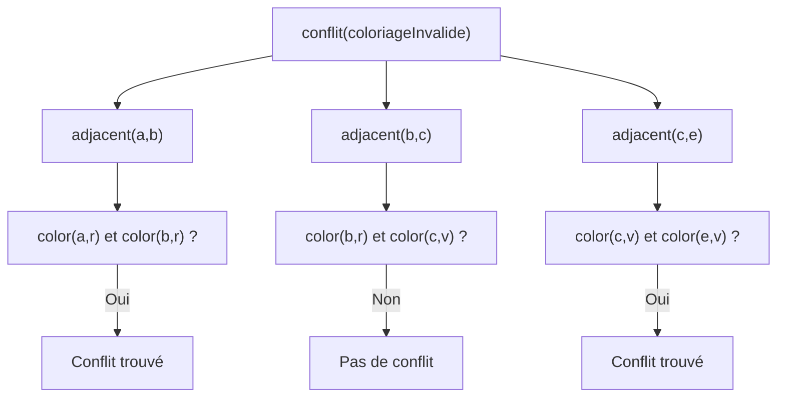
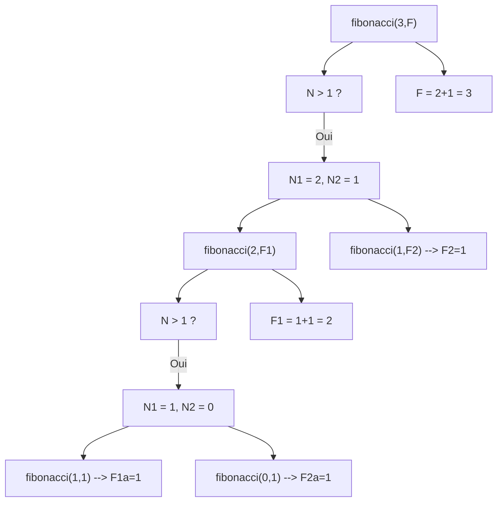
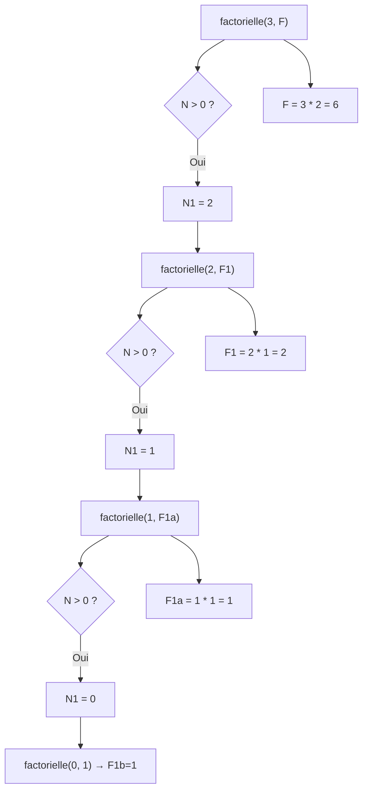

$$Ala\ eddine\ Zaouali$$
$$Aya\ Belkacem$$
## Exercice 1 : Coloriage de carte
 *en 1976, deux Américains, Kenneth Appel et Wolfgang Haken, affirment avoir démontré le théorème des quatre couleurs Leur démonstration divise la communauté scientifique : pour la première fois, en effet, la démonstration exige l'usage de l'ordinateur pour étudier les 1 478 cas critiques*
### 1. Définition des régions adjacentes
```prolog
% Symétrie
adjacent(X, Y) :- adjacent(Y, X).

% Adjacence
adjacent(a, b).
adjacent(a, c).
adjacent(a, d).
adjacent(b, c).
adjecent(b, e).
adjacent(c, d).
adjacent(c, e).
adjecent(d, e).
```
### 2. Exemples de coloriage
```prolog
% Coloriage sans conflits
coloriageValide([
    color(a, v),
    color(b, b),
    color(c, r),
    color(d, b),
    color(e, v)
]).

% Coloriage avec conflits
coloriageInvalide([
    color(a, r),
    color(b, r), % Conflit
    color(c, v),
    color(d, b),
    color(e, v) % Conflit
]).
```
### 3. Détection des conflits
```prolog
% Vérifie si deux régions adjacentes ont la même couleur
conflit(X, Y, Coloriage) :-
    adjacent(X, Y),
    member(color(X, C), Coloriage),
    member(color(Y, C), Coloriage).

% Vérifie si un coloriage contient des conflits
conflit(Coloriage) :-
    adjacent(X, Y),
    member(color(X, C), Coloriage),
    member(color(Y, C), Coloriage).
```
### Exemples d'exécution
```prolog
% Test avec coloriage valide
?- coloriageValide(C), conflit(C).
false.

% Test avec coloriage invalide
?- coloriageInvalide(C), conflit(C).
true ;
true ;
false.
```
### Arbre de raisonnement


---
## Exercice 2 : Suite de Fibonacci

### 1. Implémentation récursive
```prolog
fibonacci(0, 1). % Cas de base U0
fibonacci(1, 1). % Cas de base U1
fibonacci(N, F) :-
    N > 1,
    N1 is N - 1,
    N2 is N - 2,
    fibonacci(N1, F1),
    fibonacci(N2, F2),
    F is F1 + F2.
```
### Exemple d'exécution
```prolog
?- fibonacci(3, F).
F = 3 ;
false.
```
### Arbre de résolution


---

## Exercice 3 : Calcul factoriel

### 1. Implémentation récursive
```prolog
factorielle(0, 1). % Cas de base
factorielle(N, F) :-
    N > 0,
    N1 is N - 1,
    factorielle(N1, F1),
    F is N * F1.
```

### Exemple d'exécution
```prolog
?- factorielle(3, F).
F = 6 ;
false.
```

### Arbre de raisonnement

